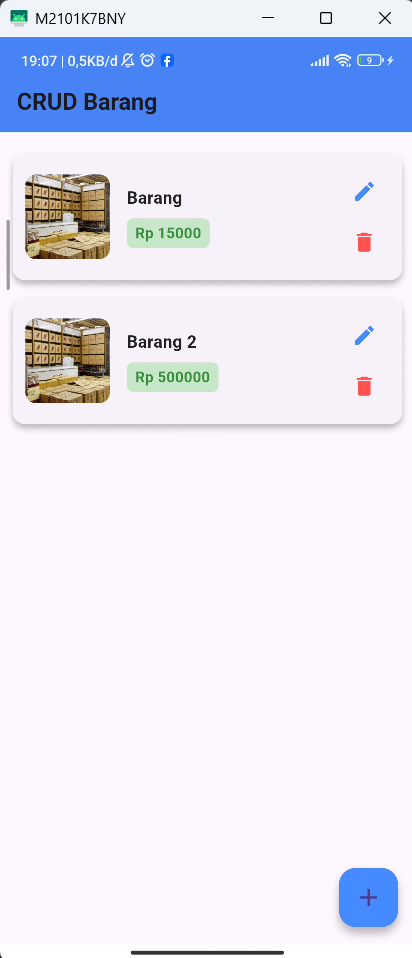
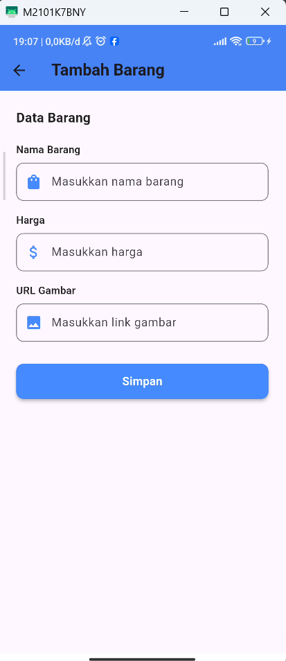
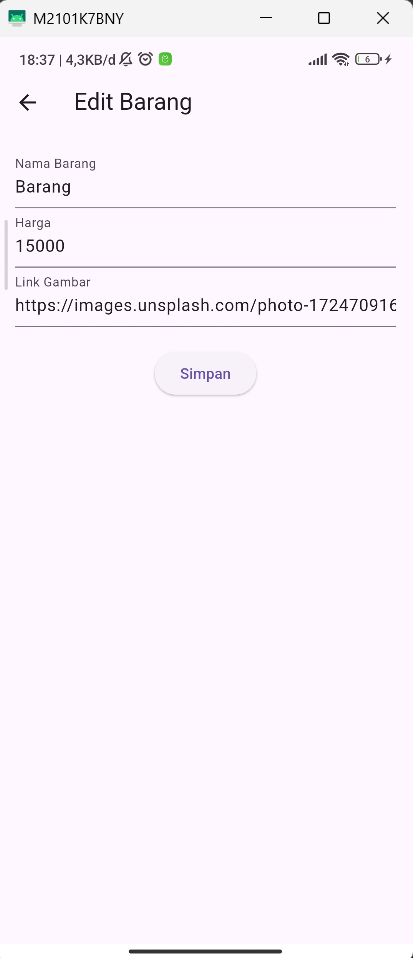

# Crud Barang Sederhana - Project Flutter

Aplikasi Flutter Crud Barang Sederhana menggunakan FireStore sebagai databasenya

---

##  Info Mahasiswa

<b>Nama:</b> Mochammad Cahyahadi Fadhlurrahman 
<b>NIM:</b> 23552011347 
<b>Kelas:</b> TIF RP 23 CID A 

---

##  Gambar

<table>
  <tr>
    <td></td>
    <td></td>
    <td></td>
  </tr>
  <tr>
    <td colspan="3" align="center"></td>
  </tr>
</table>

<video width="300" controls>
  <source src="assets/video/demo.mp4" type="video/mp4">
  Browser Anda tidak mendukung video tag.
</video>
